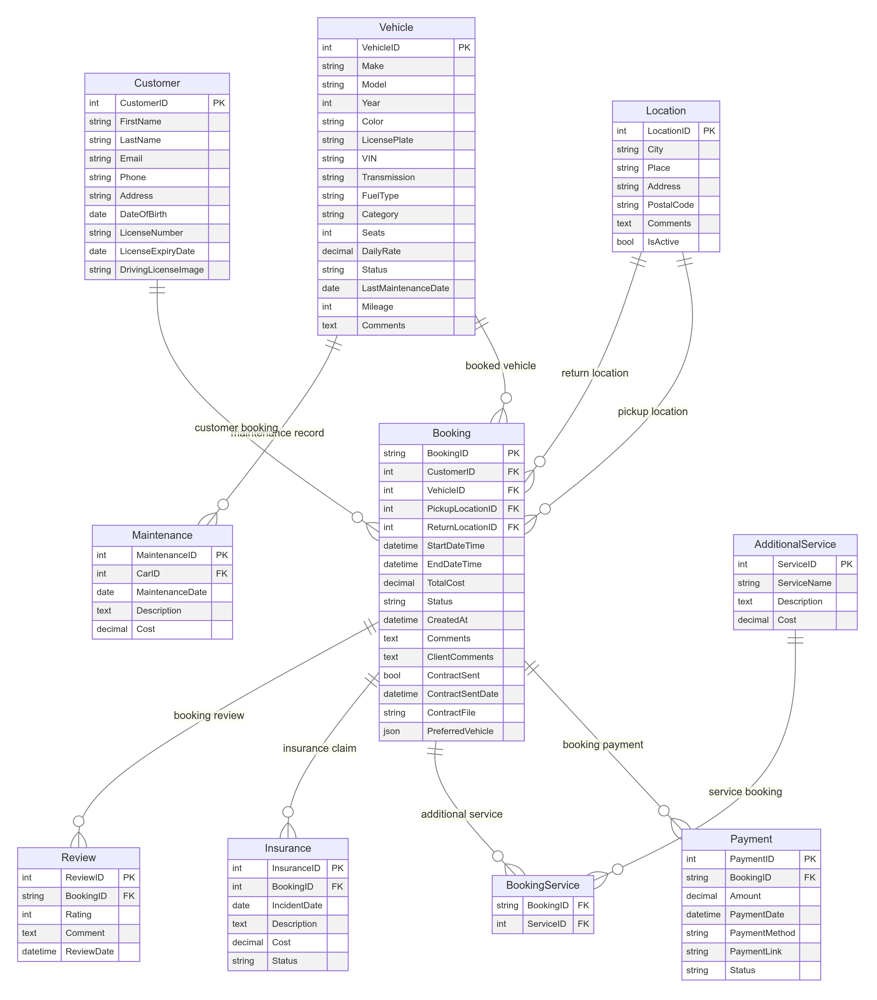

## Narvik Rent a Car Website & Database Project Summary

This document summarizes the key insights, user stories, and requirements extracted from the provided meeting transcription for the Narvik Rent a Car website and database project. Future plans to integrate an AI agent are also considered.

**Project Scope:**

The project aims to build a website and database for Narvik Rent a Car, a small rental company owned by Vitaliy. The system should handle routine tasks, including booking cars, managing rental agreements, and maintaining vehicle records. The long-term goal is to integrate an AI agent to automate some of these processes.

**User Stories:**

* **Customer:**
* As a customer, I want to easily search and book a car online, so I can plan my trip efficiently.
* As a customer, I want to see detailed information about available cars (model, year, mileage, price, etc.), so I can make an informed decision.
* As a customer, I want to be able to upload my driver's license and other required documents online, so I can complete the booking process without needing physical paperwork.
* As a customer, I want to receive clear rental agreements and payment confirmations via email, so I have a record of my booking details.
 

* **Admin (Vitaliy):**
* As an admin, I want to manage car availability and booking information, so I can ensure cars are assigned correctly and efficiently.
* As an admin, I want to generate rental agreements and invoices, so I can process payments and maintain accurate financial records.
* As an admin, I want to track vehicle maintenance and repair records, so I can keep my fleet in good condition and minimize downtime.
* As an admin, I want to view customer booking history and communicate with customers via email or chat, so I can provide excellent customer service.
 
 
* **AI Agent (Future Implementation):**
* As an AI agent, I want to automatically process customer requests for car bookings, so I can reduce Vitaliy's workload and improve response times.
* As an AI agent, I want to generate rental agreements based on customer selections and vehicle availability, so I can streamline the booking process.
* As an AI agent, I want to assist customers with frequently asked questions, so I can provide basic information and support without Vitaliy's intervention.

**Key Insights and Requirements:**

* **Website:**
* The website should be user-friendly, responsive, and accessible on various devices (mobile, desktop).
* It should include a search function to filter cars by type, availability, and price.
* The website needs a secure customer registration and login system.
* It should have a clear contact page with contact information and a method for sending messages.
* A "frequently asked questions" (FAQ) section is recommended to address common customer queries.
* An integrated chat function could be valuable to handle customer queries in real-time.
 

* **Database:**
* The database should store comprehensive information about each car, including model, year, mileage, availability, price, maintenance records, and images.
* The database should track customer bookings, including rental dates, customer details, payment status, and rental agreements.
* Data security is crucial for protecting sensitive information like customer details and financial records.
* **AI Integration (Future):**
* The AI agent will primarily handle routine tasks like booking processing, agreement generation, and answering simple customer queries.
* The AI agent will need to be trained on a dataset of existing booking requests, customer communications, and vehicle information.
* The AI agent should be able to seamlessly integrate with the website and database for data access and information retrieval.

**Challenges:**

* **Handling peak booking times:** The system needs to be able to handle a high volume of requests during peak periods, especially during tourist season.
* **Integrating with payment systems:** Securely integrating with payment gateways like Stripe or PayPal is essential for processing online transactions.
* **Maintaining accurate data:** Ensuring data integrity and updating vehicle and availability information promptly is crucial.

**Next Steps:**

1. **Data Collection:** Vitaliy will gather and compile all relevant data about his cars and rental processes. This will include:
* Vehicle details (make, model, year, mileage, price, images)
* Existing booking requests and customer interactions
* Maintenance records and repair history
* Rental agreements and invoices
2. **Database Design:** The team will design the database structure to hold the collected data and facilitate efficient data retrieval.
3. **Website Development:** The team will begin developing the front-end and back-end of the website, incorporating the user stories and requirements outlined above.
4. **AI Integration Planning:** The team will start planning the future implementation of the AI agent, considering the tasks it will automate and the necessary data and training requirements.

## ER_diagram_database_draft_v002

## Comparison of Open Source Car Rental Management Systems

We can choose one of these solutions maybe and look closely at these open source models to find the best fit for our needs for example.

| **Criteria**                      | **BookCars**                                                | **Car Rental Management System (Flask + MySQL)**             | **Schedulebull**                                            |
|-----------------------------------|-------------------------------------------------------------|-------------------------------------------------------------|-------------------------------------------------------------|
| **Programming Language**          | TypeScript                                                  | Python                                                      | Various (JavaScript, Python, etc.)                          |
| **Framework**                     | React, Node.js                                              | Flask                                                       | Various                                                     |
| **Database**                      | SQL (supports multiple databases)                           | MySQL                                                       | Various (depending on setup)                                |
| **Fleet Management**              | Yes                                                         | Yes                                                         | Yes                                                         |
| **Booking Management**            | Yes                                                         | Yes                                                         | Yes                                                         |
| **Customer Management**           | Yes                                                         | Yes                                                         | Yes                                                         |
| **Payment and Billing**           | Stripe, PayPal, Google Pay, Apple Pay                        | MySQL Connector (integration possible)                      | Supports various payment systems                            |
| **Mobile Application**            | Yes (Android and iOS)                                       | No (web application)                                        | Yes (depending on setup)                                    |
| **Multilingual Support**          | Yes (English, French)                                       | No                                                          | Yes (multilingual support depending on configuration)       |
| **Multi-Supplier Support**        | Yes                                                         | No                                                          | Yes                                                         |
| **Security**                      | Protection against XSS, CSRF, MITM                          | Basic security measures included                            | Basic security measures included                            |
| **License**                       | MIT                                                         | MIT                                                         | Free basic version, paid advanced features                  |
| **Special Features**              | Push notifications, fleet management, secure transactions   | Easy to install and use, well-documented                    | Flexible configuration, extensible with modules             |
| **Documentation and Support**     | Good documentation, support via GitHub                      | Good documentation, support via GitHub                      | Support via website and GitHub, possible paid features      |
| **Ease of Deployment**            | Docker support                                              | Simple setup on a local server                              | Requires configuration depending on setup                   |
| **Use Cases**                     | Small and medium businesses, multi-supplier scenarios       | Small companies, educational projects                       | Small and medium businesses, multifunctional scenarios      |